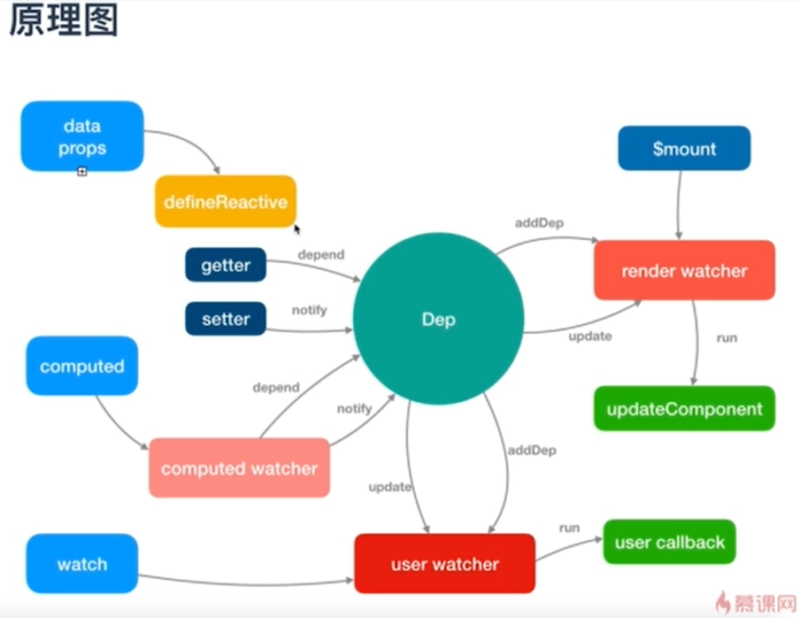

## 响应式原理

- [参考](https://www.jianshu.com/p/d137fbdc06ff)

- 

- 核心

  1. observe(data)：当你把一个普通的 JavaScript 对象传入 Vue 实例作为 data 选项，Vue 将遍历此对象所有的 property；

  2. defineProperty(data,key,handler）：将遍历完的 property 使用 Object.defineProperty 把这些 property 全部转为 getter/setter。Object.defineProperty 是 ES5 中一个无法 shim 的特性，这也就是 Vue 不支持 IE8 以及更低版本浏览器的原因。getter/setter 就是做订阅-发布处理（依赖收集与派发更新），就是在属性被调用的使用，触发 get 代理函数，订阅调用该属性的组件(将组件存放到一个订阅者数组中进行保存，这里的 Dep.target 暂时可以理解为一个全局变量，代表着的是当前正在渲染的 Vue 组件)。 而在属性被修改时，触发 set 代理函数，在 set 代理函数里，通知订阅者数组里面的每一个订阅者（组件）进行视图更新。

  3. Dep：是一个依赖类，将它理解成一个订阅者。当对一个属性进行响应式处理的时候，就会实例化一个 Dep 实例，并将用到这个属性的组件全部存放在 subs 数组里。当属性被修改时，则通知 subs 数组里的所有组件进行更新。

  4. Watcher：getter/setter 对用户来说是不可见的，但是在内部它们让 Vue 能够追踪依赖，在 property 被访问和修改时通知变更。每个组件实例都对应一个 watcher 实例，它会在组件渲染的过程中把“接触”过的数据 property 记录为依赖。之后当依赖项的 setter 触发时，会通知 watcher，从而使它关联的组件重新渲染。（等这些属性进行被修改时，就会通知这个 watcher，再次调用这个 watcher 里面的 render 函数，进行虚拟 dom 的 diff 和更新）

- vue2 响应式不足之处

  1. 动态添加响应式属性必须用 Vue.set();

     > 对像：对于已经创建的实例，Vue 不允许动态添加根级别的响应式 property。但是，可以使用 Vue.set(object, propertyName, value) 方法向嵌套对象添加响应式 property；
     > 数组：当你利用索引直接设置一个数组项时，例如：vm.items[indexOfItem] = newValue，通过`Vue.set(vm.items, indexOfItem, newValue)`解决；当你修改数组的长度时，例如：vm.items.length = lewLength；通过`vm.items.splice(newLength)`解决

  2. 直接操作数组索引无法触发视图更新

  3. 数据的响应式处理和视图未完全解耦

## 全局 API

- Vue.use(plugins) 注册一个插件

  ```
  import Vue from 'vue'
  import Router from 'vue-router'

  Vue.use(VueRouter)
  ```

- Vue.directive()创建或者获取自定义指令

  ```
  // 注册(指令函数)
  Vue.directive('my-directive', {
    bind: function () {},
    inserted: function () {},
    update: function () {},
    componentUpdated: function () {},
    unbind: function () {}
  })

  // 注册 (指令函数)
  Vue.directive('my-directive', function () {
    // 这里将会被 `bind` 和 `update` 调用
  })

  // getter，返回已注册的指令
  var myDirective = Vue.directive('my-directive')
  ```

- Vue.filter() 注册或者获取全局的过滤器
  **注册**

  ```
  //全局过滤器
  import Vue from 'vue';
  Vue.filter('formatString', function (value) {
    var msg = value.length > 10 ? value.slice(0,3): value;
    return msg;
  });
  ```

  **使用**

  ```
  //使用
  <template>
    <div id="app">
      {{msg | formatString}}
      {{student.name | formatString}}
      <ChildComponent v-bind:message="msg | formatString"></ChildComponent>
    </div>
  </template>
  ```

- `Vue.nextTick([callback, context])` 在 DOM 更新之后调用回调函数

  ```
  //全局
  Vue.nextTick(() => {
    // DOM 更新了
  })
  // 局部
  this.$nextTick(() => {
    console.log("nextTick操作")
  })
  ```

- Vue.set(target, propertyName/index, value) or this.$set(target, propertyName/index, value)

  > 向响应式数据添加一个属性，并且保证该属性也是响应式的，且能够触发视图的更新。

  ```
  export default {
    name: 'App',
    data(){
      return {
        msg: "启动测试页面啦啦啦",
        student: {
          name: 1,
          age: 2,
        }
      }
    },
    mounted(){
      this.$set(this.student, "sex","女");
    }
  }
  ```

- Vue.delete( target, propertyName/index )

  > 删除一个对象的属性，如果属性是响应式的，确保删除属性并且更新视图

- Vue.mixin()混入

  > 混入 (mixin) 提供了一种非常灵活的方式，来分发 Vue 组件中的可复用功能。一个混入对象可以包含任意组件选项。当组件使用混入对象时，所有混入对象的选项将被“混合”进入该组件本身的选项。

  **局部**

  > 当组件和混入对象含有同名选项时，这些选项将以恰当的方式进行“合并”。比如，数据对象在内部会进行递归合并，并在发生冲突时以组件数据优先。

  ```
  var mixin = {
    data: function () {
      return {
        message: 'hello',
        foo: 'abc'
      }
    }
  }

  new Vue({
    mixins: [mixin],
    data: function () {
      return {
        message: 'goodbye',
        bar: 'def'
      }
    },
    created: function () {
      console.log(this.$data)
      // => { message: "goodbye", foo: "abc", bar: "def" }
    }
  })
  ```

  **全局**

  ```
  // 为自定义的选项 'myOption' 注入一个处理器。
  Vue.mixin({
    created: function () {
      var myOption = this.$options.myOption
      if (myOption) {
        console.log(myOption)
      }
    }
  })

  new Vue({
    myOption: 'hello!'
  })
  // => "hello!"
  ```

- Vue.compile(template)

  > 参数： template {string}；在 render 函数中编译模板字符串。只在独立构建时有效

- Vue.observable( object )

  > 让一个对象可响应。Vue 内部会用它来处理 data 函数返回的对象

  > 返回的对象可以直接用于渲染函数和计算属性内，并且会在发生改变时触发相应的更新。也可以作为最小化的跨组件状态存储器，用于简单的场景：

  ```
  const state = Vue.observable({ count: 0 })
  const Demo = {
    render(h) {
      return h('button', {
        on: { click: () => { state.count++ }}
      }, `count is: ${state.count}`)
    }
  }
  ```

## v-model 原理

- v-model 本质上就是语法糖
  ```
  let vm = new Vue({
    el: '#app',
    template: `
      <div>
        <p>Message is {{ message }</p>}
        <input v-model="message" placeholder="edit me">
        <!-- <input :value="message=$event.target.value" placeholder="语法糖"> -->
      </div>
    `,
    data() {
      return {
        message: ''
      }
    }
  })
  ```
- 组件级别上的应用，这里的 lovingVue 的值将会传入这个名为 checked 的 prop。同时当 <base-checkbox> 触发一个 change 事件并附带一个新的值的时候，这个 lovingVue 的 property 将会被更新。

  ```
  // 父组件
  <base-checkbox v-model="lovingVue"></base-checkbox>

  // 子组件
  Vue.component('base-checkbox', {
    model: {
      prop: 'checked',
      event: 'change'
    },
    props: {
      checked: Boolean
    },
    template: `
      <input
        type="checkbox"
        v-bind:checked="checked"
        v-on:change="$emit('change', $event.target.checked)"
      >
    `
  })
  ```

## 高阶组件

- 所谓高阶组件其实就是高阶函数，React 和 Vue 都证明了一件事儿：一个函数就是一个组件。所以组件是函数这个命题成立了，那高阶组件很自然的就是高阶函数，即一个返回函数的函数

  ```
  // 防抖函数
  function debounce (func, delay, context, event) {
    clearTimeout(func.timer)
    func.timer = setTimeout(function () {
      func.call(context, event)
    }, delay)
  }
  // 导出新组件
  export default {
    props: {},
    name: 'ButtonHoc',
    data () {
      return {}
    },
    mounted () {
      console.log('HOC succeed')
    },
    methods: {
      handleClickLink (event) {
        let that = this
        console.log('debounce')
        // that.$listeners.click为绑定在新组件上的click函数
        debounce(that.$listeners.click, 300, that, event)
      }
    },
    render (h) {
      const slots = Object.keys(this.$slots)
        .reduce((arr, key) => arr.concat(this.$slots[key]), [])
        .map(vnode => {
          vnode.context = this._self
          return vnode
        })
      return h('Button', {
        on: {
          click: this.handleClickLink //新组件绑定click事件
        },
        props: this.$props,
        // 透传 scopedSlots
        scopedSlots: this.$scopedSlots,
        attrs: this.$attrs
      }, slots)
    }
  }
  ```

- 总结:HOC 的特点在于它的包裹性，上列源码我们做了这些操作，来实现包裹 iview 的 Button 组件，劫持 click 事件，（1）创建 debounce 防抖函数，导出新组件，render 渲染出 iview button,button 绑定 debounce 后的 click 方法。

## vue组件之间通信

  1. props和$emit(常用)

    > 父组件向子组件传递数据是通过prop传递的，子组件传递数据给父组件是通过$emit触发事件来做到的
    ```
    <child :message="message" v-on:getChildData="getChildData"></child>
    props:['message']
    this.$emit('getChildData',val)
    ```
  2. $attrs和$listeners

    > A > B > C

    ```
    // A组件
    <B :messagec="messagec" :message="message" v-on:getCData="getCData" v-on:getChildData="getChildData(message)"></B>
    // B组件；C组件中能直接触发getCData的原因在于 B组件调用C组件时 使用 v-on 绑定了$listeners 属性；
    // 通过v-bind 绑定$attrs属性，C组件可以直接获取到A组件中传递下来的props（除了B组件中props声明的)
    <C v-bind="$attrs" v-on="$listeners"></C>
    // C组件
    <input type="text" v-model="$attrs.messagec" @input="passCData($attrs.messagec)"> </div>
    ```

  3. 中央事件总线Bus（非父子组件间通信）

    > 上面两种方式处理的都是父子组件之间的数据传递，而如果两个组件不是父子关系呢？这种情况下可以使用中央事件总线的方式。新建一个Vue事件bus对象，然后通过bus.$emit触发事件，bus.$on监听触发的事件。

    ```
    var bus=new Vue()
    bus.$emit('globalEvent',val)
    bus.$on('globalEvent', (val)=> {
      ...
    })
    ```

  4. v-model

    > 父组件通过v-model传递值给子组件时，会自动传递一个value的prop属性，在子组件中通过this.$emit(‘input',val)自动修改v-model绑定的值

    ```
    // parent
    <child v-model="message"></child>

    // child
    props: {
      value: String, //v-model会自动传递一个字段为value的prop属性
    }
    this.$emit('input',this.mymessage)
    ```

  5. provide和inject

    > 成对出现，用于父级组件向下传递数据

    > 父组件中通过provider来提供变量，然后在子组件中通过inject来注入变量。不论子组件有多深，只要调用了inject那么就可以注入provider中的数据。而不是局限于只能从当前父组件的prop属性来获取数据，只要在父组件的生命周期内，子组件都可以调用。

    ```
    // parent
    provide:{
      for:'test'
    }

    // child
    inject:['for'] // 得到父组件传递过来的数据
    ```

  6. $parent和$children

    > 在组件内部可以直接通过子组件$parent对父组件进行操作，父组件通过$children对子组件进行操作

    ```
    // parent
    <child></child>
    this.$children[0].childMessage = 'hello'

    // child
    this.$parent.message = this.childMessage // 通过如此调用可以改变父组件的值
    ```
  7. vuex

    > 如果业务逻辑复杂，很多组件之间需要同时处理一些公共的数据，这个时候才有上面这一些方法可能不利于项目的维护，vuex的做法就是将这一些公共的数据抽离出来，然后其他组件就可以对这个公共数据进行读写操作，这样达到了解耦的目的。


## 动态组件 & 异步组件

- keep-alive：希望某些标签的组件实例能够被在它们第一次被创建的时候缓存下来，include - 字符串或正则表达式。只有名称匹配的组件会被缓存。exclude - 字符串或正则表达式。任何名称匹配的组件都不会被缓存。max - 数字。最多可以缓存多少组件实例。
```
<!-- 失活的组件将会被缓存！-->
<keep-alive>
  <component v-bind:is="currentTabComponent"></component>
</keep-alive>
```

- 异步组件：在大型应用中，我们可能需要将应用分割成小一些的代码块，并且只在需要的时候才从服务器加载一个模块。为了简化，Vue 允许你以一个工厂函数的方式定义你的组件，这个工厂函数会异步解析你的组件定义。Vue 只有在这个组件需要被渲染的时候才会触发该工厂函数，且会把结果缓存起来供未来重渲染。
```
// 定义
Vue.component('async-example', function (resolve, reject) {
  setTimeout(function () {
    // 向 `resolve` 回调传递组件定义
    resolve({
      template: '<div>I am async!</div>'
    })
  }, 1000)
})

// 引入
new Vue({
  components: {
    'my-component': () => import('./my-async-component')
  }
})
```

- 异步组件-处理加载状态：工厂函数也可以返回一个如下格式的对象：
```
const AsyncComponent = () => ({
  // 需要加载的组件 (应该是一个 `Promise` 对象)
  component: import('./MyComponent.vue'),
  // 异步组件加载时使用的组件
  loading: LoadingComponent,
  // 加载失败时使用的组件
  error: ErrorComponent,
  // 展示加载时组件的延时时间。默认值是 200 (毫秒)
  delay: 200,
  // 如果提供了超时时间且组件加载也超时了，
  // 则使用加载失败时使用的组件。默认值是：`Infinity`
  timeout: 3000
})
```